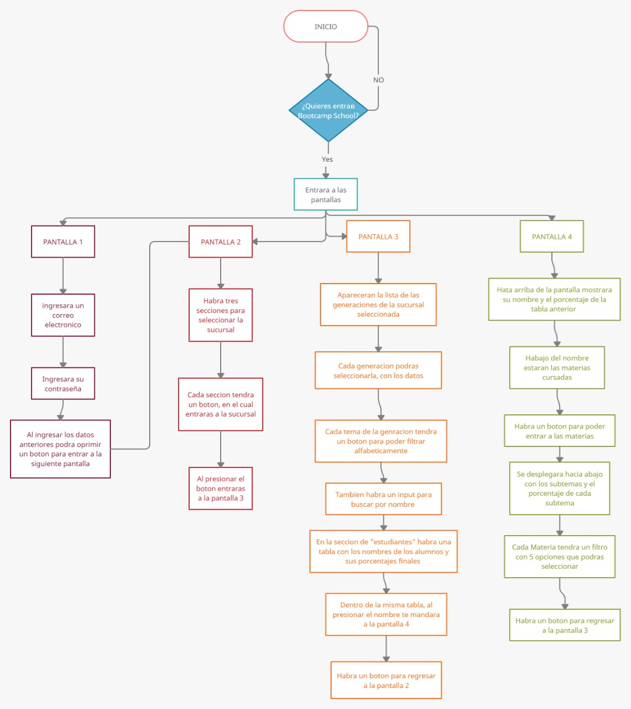
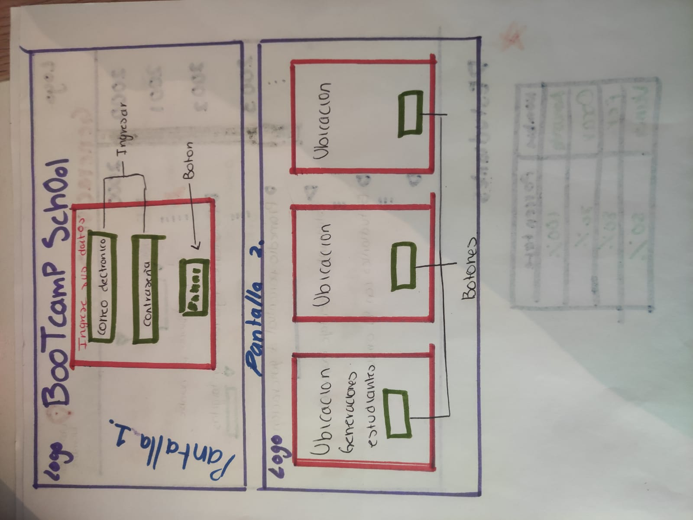
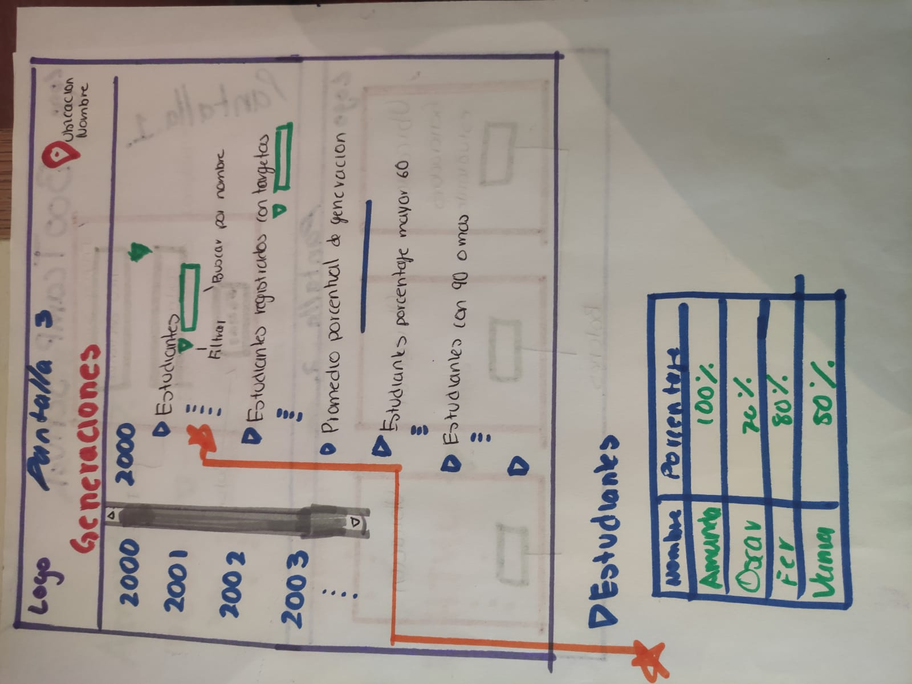
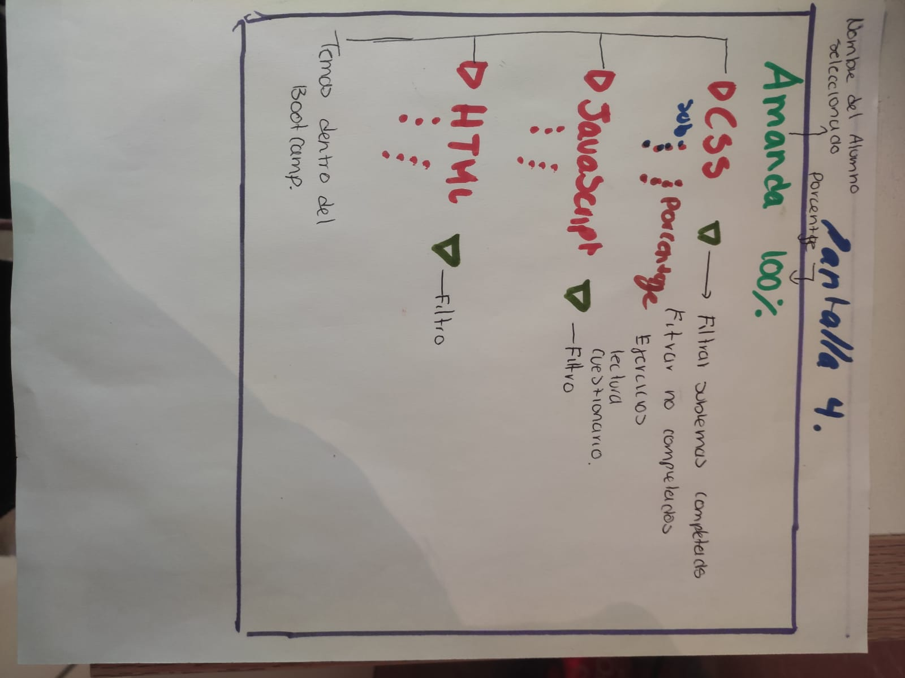
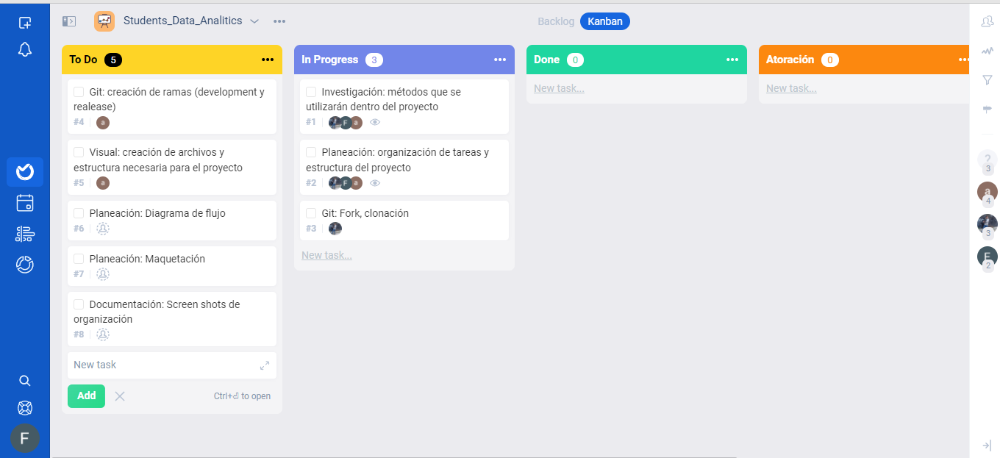
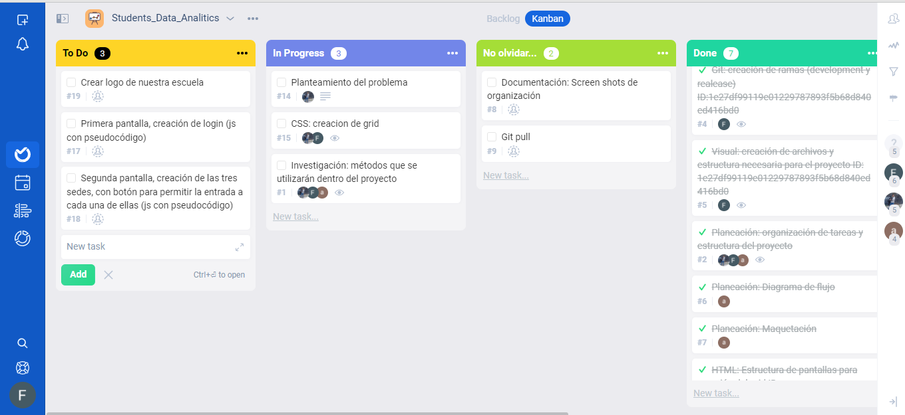

# 06_Students_data-analitics

## Análisis de datos estudiantiles

### Introducción:

Bootcamp School campus Ajusco, es una institución que se dedica a la enseñanza y aprendizaje en materia de desarrollo software, el cual se ha mantenido en crecimiento gradual gracias a su plan de estudios, pues no sólo incluye el desarrollo de habilidades técnicas, sino también de actitudes interpersonales que coadyuvan a nutrir las aptitudes necesarias para el trabajo organizacional en un amplio alcance laboral.

Como institución de vanguardia, Bootcamp Ajusco, ha creado su propia base de datos, en el cual se han registrado el progreso de los estudiantes en la plataforma de estudio. Sin embargo, los datos por sí solos son de poca utilidad, para transformar estos datos en información necesitamos procesarlos y comprenderlos. Una forma de realizar esta tarea es creando visualizaciones dinámicas que permitan facilitar su análisis y estructura, mismas que promuevan la toma de decisiones adecuadas que en el devenir de su labor académica, y en la atención de sus problemas emergentes, funja como auxiliar tecnológico para el logro de sus objetivos institucionales.

Es por ello que nos damos a la tarea en desarrollar las herramientas tecnológicas necesarias que permitan facilitar el análisis de los datos registrados mediante una aplicación enfocada para el uso interno de las autoridades académicas de Ajusco Bootcamp School.

La interfaz permite al usuario:

Mostrar un inicio de sesión con el logotipo de Bootcamp School para el director de la escuela o académico autorizado.
Tener una primera vista que enumera las 3 ubicaciones de la escuela Bootcamp y haga clic en cada una que muestra la página de la sucursal.
Mostrar la información con el nombre del campus y una imagen de la ubicación así como mostrar las generaciones disponibles para hacer clic y encontrar los estudiantes registrados para cada generación.

#### Por generación:

Mostrar, para cada generación, cuántos estudiantes se registraron y buscar alumnos por nombre.
Mostrar el promedio porcentual de generación del progreso de finalización.
Mostrar, para identificar, a los estudiantes con un porcentaje inferior al 60.
Mostrar, para identificar, a los estudiantes con 90 o más de porcentaje de competencia.
Enumere y pueda seleccionar a los estudiantes que muestran el porcentaje general de finalización de cada estudiante, ordenados por nombre alfabéticamente.

#### Para cada alumno:

Poder hacer clic en para mostrar el informe de progreso
Mostrar porcentaje completado para todos los temas
Calcular el porcentaje de tiempo completado para cada tema.
Enumerar los subtemas de cada tema
Capacidad para filtrar subtemas completados y no completados de cada tema.
Ser capaz de filtrar subtemas por tipo (ejercicios, lecturas y cuestionarios)

```text
./
├── .editorconfig
├── .eslintrc
├── .gitignore
├── README.md
├── package.json
├── assets
└── data
    ├── students.json
├── src
│   ├── app.js
│   ├── data.js
│   ├── index.html
│   ├── index.js
│   └── style.css
└── test
    ├── app.spec.js
    └── index.html
```

## Diagrama de flujo



## Maquetación







## Planeación




### Scripts / Files

- `README.md`: should explain how to download, install and run the application as well as an introduction to the application, its functionality and decisions about design they took.
- `assets /`: Should contain your assets like images, logos, etc.
- `src / index.html`: this is the entry point to your application. This file must contain to _markup_ (HTML) and include the necessary CSS and JavaScript for index.js module.
- `src / app.js`: here you must implement the web application main functionality to manipulate the data coming from data.js
- `src / data.js`: here you must fetch/get the data from the local JSON and then export it to be used in the app.js module.
- `src / index.js`: here you must listen to DOM events, like create and add events to the DOM and get the search values to be processed to app.js.
- `test / app.spec.js`: this file contains some sample tests and here you will have to imp
